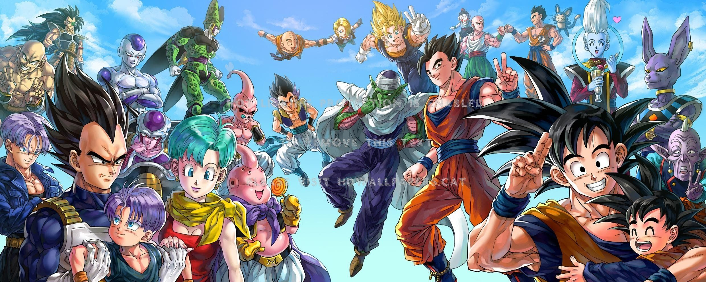
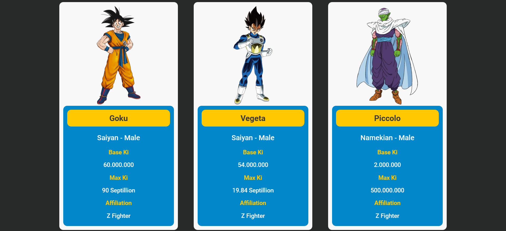

# Dragon Ball API v2.0



## About

A Brand new Dragon Ball API with redesigned looks and now featuring planets from the entire series! Check the info about your favorite characters and discover the most important places in the Dragon Ball universe.

Visit the website following this //link.



The site uses the API provided by [The Dragonball API](https://web.dragonball-api.com/) made by Antonio Alvarez.

## Source Code

Download the latest source by running the command below:

```
git clone git@github.com:DinGo21/Project-Dragon-Ball-API-v2.0.git dragon_ball_apiv2.0
```

## Copyright

This project is intended for educational puposes. All Dragon Ball characters, images, and related content featured in this project are the intellectual property of their respective creators, Akira Toriyama and Toei Animation.
